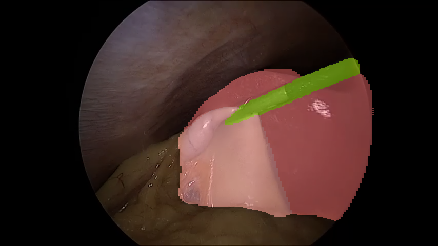
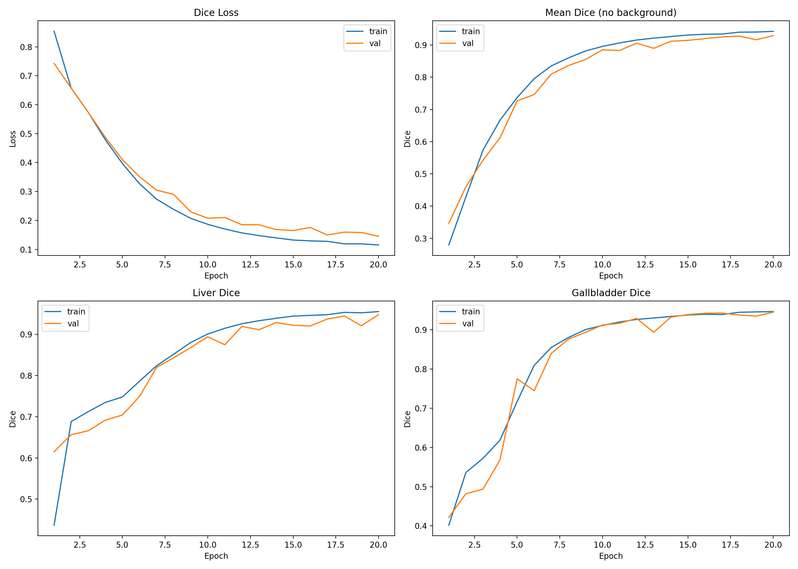

# Robotic Hepatobiliary Navigation

Scene segmentation for robotic intraoperative navigation and path planning in hepatobiliary surgery.

This project explores surgical scene segmentation using UNet and TransUNet to support robotic intraoperative navigation and path planning in hepatobiliary surgery.

The system identifies key structures such as liver, gallbladder, and surgical instruments to provide semantic perception for autonomous or assisted robotic navigation.

## Features

- Surgical scene segmentation
- UNet baseline model
- TransUNet transformer-based segmentation
- Liver, gallbladder, and instrument detection
- Visualization of segmentation results

## Dataset

The project uses laparoscopic hepatobiliary surgery images.

Dataset structure:
```
dataset/
  train/
    images/
    masks/

  val/
    images/
    masks/

  test/
    images/
```

## Training

Train UNet:

```bash
python train_unet_4class_dice.py

## Results

### UNet

Example prediction 1:


Example prediction 2:



Training curves:


